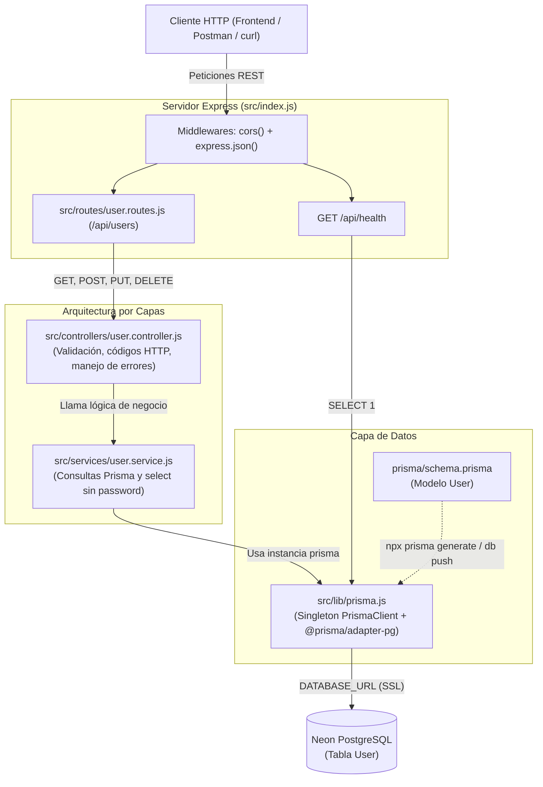

# Arquitectura del Proyecto

Diagrama de flujo y capas de la API con Express, Prisma y Neon PostgreSQL:

```mermaid
flowchart TB
    Client["Cliente HTTP (Frontend / Postman / curl)"]

    subgraph Express["Servidor Express (src/index.js)"]
        Middlewares["Middlewares: cors() + express.json()"]
        Health["GET /api/health"]
        Routes["src/routes/user.routes.js (/api/users)"]
    end

    subgraph Capas["Arquitectura por Capas"]
        Controller["src/controllers/user.controller.js\n(Validación, códigos HTTP, manejo de errores)"]
        Service["src/services/user.service.js\n(Consultas Prisma y select sin password)"]
    end

    subgraph Datos["Capa de Datos"]
        PrismaLib["src/lib/prisma.js\n(Singleton PrismaClient + @prisma/adapter-pg)"]
        Schema["prisma/schema.prisma\n(Modelo User)"]
    end

    Neon[("Neon PostgreSQL\n(Tabla User)")]

    Client -->|"Peticiones REST"| Middlewares
    Middlewares --> Health
    Middlewares --> Routes
    Routes -->|"GET, POST, PUT, DELETE"| Controller
    Controller -->|"Llama lógica de negocio"| Service
    Service -->|"Usa instancia prisma"| PrismaLib
    Health -->|"SELECT 1"| PrismaLib
    Schema -.->|"npx prisma generate / db push"| PrismaLib
    PrismaLib -->|"DATABASE_URL (SSL)"| Neon
```
